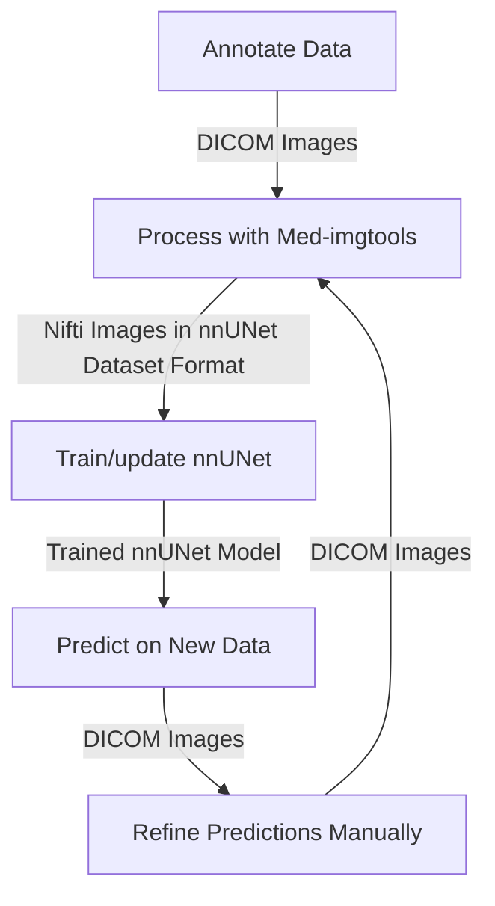

# IterSeg: Iterative Segmentation Framework  

**IterSeg** is an iterative learning framework for medical image segmentation, inspired by the approach used in *TotalSegmentator* [(Wasserthal et al., 2023)](https://doi.org/10.1148/ryai.230024). This framework facilitates semi-automated segmentation by leveraging an initial set of manually labeled cases to train a preliminary model, which is then refined iteratively.  

By integrating [`med-imagetools`](https://github.com/bhklab/med-imagetools) for preprocessing and [`nnUNet`](https://github.com/MIC-DKFZ/nnUNet) for segmentation, **IterSeg** streamlines the annotation workflow, reducing manual effort while improving segmentation accuracy.  

## Install

```console
conda env create --name iterseg --file=environment.yml
conda activate iterseg
```

```console
pip install -e git+https://github.com/bhklab/med-imagetools.git@JoshuaSiraj/update_to_nnUnetv2#egg=med-imagetools
```

## Steps



### Annotate Data

Manually label a small set of images to create an initial dataset for training. The annotated data must be in DICOM format, and the annotations must either be SEG or RTSTRUCT.

### Process with Med-imgtools

Use `med-imagetools` to convert the DICOM images to NIFTI images and save in nnUNet dataset format.

```console
autopipeline \
  [INPUT_DIRECTORY] \
  [OUTPUT_DIRECTORY] \
  --modalities [MODALITIES] \ # Default usage would be CT,RTSTRUCT
  --nnunet \
  --roi_yaml_path [CONFIG_PATH] \ # Example can be found in configs/roi_yaml_example.yaml
  --read_yaml_label_names
  ```

### Train/update nnUNet

Train or update the nnUNet model using the processed data. You can find the scripts to plan and train using nnUNet in the output directory of the `autopipeline` command.

For more information, see the med-imagetools documentation in the nnUNet option [here](https://bhklab.github.io/med-imagetools/devel/cli/nnUNet/)

### Predict on New Data

Use the trained nnUNet model to predict on new data. You can find provided scripts to predict using nnUNet in `src/predict_nnunet.py`

### Refine Predictions Manually

Manually refine the predictions. The refined predictions must be in DICOM format as described above.

### Repeat
