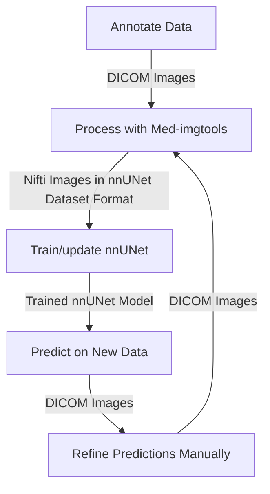

# IterSeg: Iterative Segmentation Framework  

**IterSeg** is an iterative learning framework for medical image segmentation, inspired by the approach used in *TotalSegmentator* [(Wasserthal et al., 2023)](https://doi.org/10.1148/ryai.230024). This framework facilitates semi-automated segmentation by leveraging an initial set of manually labeled cases to train a preliminary model, which is then refined iteratively.  

By integrating [`med-imagetools`](https://github.com/bhklab/med-imagetools) for preprocessing and [`nnUNet`](https://github.com/MIC-DKFZ/nnUNet) for segmentation, **IterSeg** streamlines the annotation workflow, reducing manual effort while improving segmentation accuracy.  

## Install

```console
conda env create --name iterseg --file=environment.yml
conda activate iterseg
```

## Directory Structure

- **Raw data:** `data/rawdata/<dataset_id>/<YYYY-MM-DD>__<dataset_id>/`
- **Processed data:** `data/procdata/<dataset_id>/<YYYY-MM-DD>__<dataset_id>/`
  - `nnUNet_raw/`, `nnUNet_preprocessed/`, `nnUNet_results/`
- **Results:** `data/results/<dataset_id>/latest` (symlink to latest nnUNet results)

See `data/rawdata/README.md`, `data/procdata/README.md`, and `data/results/README.md` for more details and examples.

## Steps



### 1. Annotate Data

Manually label a small set of images to create an initial dataset for training. The annotated data must be in DICOM format, and the annotations must either be SEG or RTSTRUCT.

### 2. Process with Med-imgtools

Use `med-imagetools` to convert the DICOM images to NIFTI images and save in nnUNet dataset format. This is automated via:

```console
python workflow/scripts/run_prepare_data.py <dataset_id> <dataset_date>
```

- **ROI YAML config required:** Each dataset must have a YAML config file named `roi_<dataset_id>.yaml` placed in the `config/` directory. This file specifies the ROIs (regions of interest) to extract during preprocessing.
- **Example:**

  For a dataset with ID `PM_IASLC`, the config file should be named:
  ```
  roi_PM_IASLC.yaml
  ```
  Example contents:
  ```yaml
  GTV: GTV.*
  ```
  This will match all ROIs with names starting with `GTV`.
- Example modalities: `CT,RTSTRUCT` (default).
- The script will call `imgtools nnunet-pipeline` and run nnUNet preprocessing.

For more information, see the med-imagetools documentation [here](https://bhklab.github.io/med-imagetools)

### 3. Train/update nnUNet

Train or update the nnUNet model using the processed data. This is automated via:

```console
python workflow/scripts/run_train.py <dataset_id> <dataset_date>
```

- Supports multi-GPU and multi-fold training.
- Uses environment variables for nnUNet paths.
- After training, a symlink to the latest results is created in `data/results/<dataset_id>/latest`.

### 4. Predict on New Data

Use the trained nnUNet model to predict on new data. Example usage:

```python
from workflow.scripts.inference.predict_nnunet import nnUNetPredictorWrapper

predictor = nnUNetPredictorWrapper(
    model_training_output_dir='data/results/<dataset_id>/latest',
)
prediction = predictor.predict_single_dicom('/path/to/dicom_folder')
```

See `workflow/scripts/inference/predict_nnunet.py` for details.

### 5. Refine Predictions Manually

Manually refine the predictions. The refined predictions must be in DICOM SEG or RTSTRUCT format as described above. Place the refined segmentations back in the raw data directory for the next iteration.

### 6. Repeat

## Full Pipeline Automation

To run the full pipeline (preprocessing and training) for a dataset, use:

```console
python workflow/scripts/run_pipeline.py <dataset_id>
```

This will automatically find the latest data, preprocess it, and submit training jobs (using SLURM if available).

## Notes
- All scripts are in `workflow/scripts/`.
- SLURM job submission is supported for cluster environments.
- For more information, see the med-imagetools documentation [here](https://bhklab.github.io/med-imagetools) and the nnUNet documentation [here](https://github.com/MIC-DKFZ/nnUNet/blob/master/documentation/dataset_format.md).
